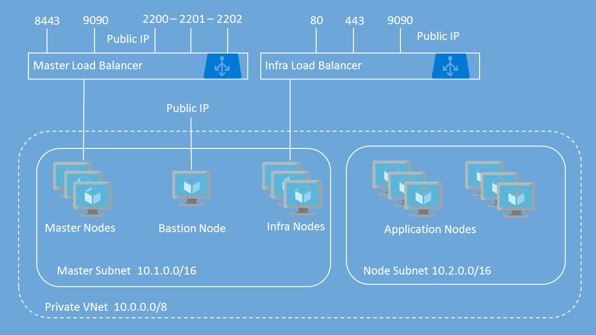

# OpenShift Container Platform Deployment Template


## General prerequisites
 
* HW: Hardware with enabled Intel VT-x or AMD-V technology
* OS: Windows 7 /Windows 10 / Linux / MacOS **with admin/root permissions** 
    * For Windows 7 users - use [Docker Toolbox for Windows 7](https://docs.docker.com/toolbox/toolbox_install_windows/)
    * Alternative: [Deploy Docker on Ubuntu VM in Azure](https://azuremarketplace.microsoft.com/en-us/marketplace/apps/CanonicalandMSOpenTech.DockerOnUbuntuServer1404LTS), detailed instructions [here](https://blogs.msdn.microsoft.com/opensourcemsft/2015/09/26/step-by-step-set-up-docker-on-azure-connect-to-nginx-container-from-windows/)
* Docker on local OS: https://www.docker.com/community-edition#/download
* Azure CLI 2.0: https://azure.github.io/projects/clis/
* Optional: Visual Studio Code https://code.visualstudio.com + extensions:
    * YAML https://marketplace.visualstudio.com/items?itemName=adamvoss.yaml
    * Docker https://marketplace.visualstudio.com/items?itemName=PeterJausovec.vscode-docker
    * Python https://marketplace.visualstudio.com/items?itemName=ms-python.python
    * C# https://marketplace.visualstudio.com/items?itemName=ms-vscode.csharp
    * Azure Resource Manager Tools https://marketplace.visualstudio.com/items?itemName=msazurermtools.azurerm-vscode-tools
    * Visual Studio Team Services https://marketplace.visualstudio.com/items?itemName=ms-vsts.team
    * Azure Account https://marketplace.visualstudio.com/items?itemName=ms-vscode.azure-account
    * Azure CLI Tools https://marketplace.visualstudio.com/items?itemName=ms-vscode.azurecli
    * NuGet Package Manager https://marketplace.visualstudio.com/items?itemName=jmrog.vscode-nuget-package-manager


## OpenShift Container Platform 3.6 with Username / Password authentication for OpenShift

This template deploys OpenShift Container Platform with basic username / password for authentication to OpenShift. It includes the following resources:

|Resource           	|Properties                                                                                                                          |
|-----------------------|------------------------------------------------------------------------------------------------------------------------------------|
|Virtual Network   		|**Address prefix:** 10.0.0.0/8<br />**Master subnet:** 10.1.0.0/16<br />**Node subnet:** 10.2.0.0/16                      |
|Master Load Balancer	|2 probes and 2 rules for TCP 8443 and TCP 9090 <br/> NAT rules for SSH on Ports 2200-220X                                           |
|Infra Load Balancer	|3 probes and 3 rules for TCP 80, TCP 443 and TCP 9090 									                                             |
|Public IP Addresses	|Bastion Public IP for Bastion Node<br />OpenShift Master public IP attached to Master Load Balancer<br />OpenShift Router public IP attached to Infra Load Balancer            |
|Storage Accounts   	|1 Storage Account for Bastion VM <br />1 Storage Account for Master VMs <br />1 Storage Account for Infra VMs<br />2 Storage Accounts for Node VMs<br />1 Storage Account for Private Docker Registry<br />1 Storage Account for Persistent Volumes  |
|Network Security Groups|1 Network Security Group for Bastion VM<br />1 Network Security Group Master VMs<br />1 Network Security Group for Infra VMs<br />1 Network Security Group for Node VMs |
|Availability Sets      |1 Availability Set for Master VMs<br />1 Availability Set for Infra VMs<br />1 Availability Set for Node VMs  |
|Virtual Machines   	|1 Bastion Node - Used to Run Ansible Playbook for OpenShift deployment<br />1, 3, 5 Master Nodes<br />1, 2, 3 Infra Nodes<br />User-defined number of Nodes (1 to 30)<br />All VMs include a single attached data disk for Docker thin pool logical volume|



## READ the instructions in its entirety before deploying!

This template deploys multiple VMs and requires some pre-work before you can successfully deploy the OpenShift Cluster.  If you don't get the pre-work done correctly, you will most likely fail to deploy the cluster using this template.  Please read the instructions completely before you proceed. 

This template allows you to choose between a custom VHD image in an existing Storage Account or the On-Demand Red Hat Enterprise Linux image from the Azure Gallery. 
>If you use the On-Demand image, there is an hourly charge for using this image.  At the same time, the instance will be registered to your Red Hat subscription, so you will also be using one of your entitlements. This will lead to "double billing".

After successful deployment, the Bastion Node is no longer required unless you want to use it to add nodes or run other playbooks in the future.  You can turn it off and delete it or keep it around for running future playbooks.  You can also use this as the jump host for managing your OpenShift cluster.

## Prerequisites

### Generate SSH Keys

You'll need to generate an SSH key pair (Public / Private) in order to provision this template. Ensure that you do **NOT** include a passphrase with the private key. <br/><br/>

         ssh-keygen -f ~/.ssh/openshift_rsa -t rsa -N ''

### Create Key Vault to store SSH Private Key

You will need to create a Key Vault to store your SSH Private Key that will then be used as part of the deployment.  This extra work is to provide security around the Private Key - especially since it does not have a passphrase.  I recommend creating a Resource Group specifically to store the KeyVault.  This way, you can reuse the KeyVault for other deployments and you won't have to create this every time you chose to deploy another OpenShift cluster.

**Create Key Vault using Azure CLI 2.0**<br/>

  a.  Create new Resource Group: az group create -n \<name\> -l \<location\>

         az group create -n ... -l 'Southeast Asia'

  b.  Create Key Vault: az keyvault create -n \<vault-name\> -g \<resource-group\> -l \<location\> --enabled-for-template-deployment true<br/>
  
         az keyvault create -n ... -g ... -l 'Southeast Asia' --enabled-for-template-deployment true

  c.  Create Secret: az keyvault secret set --vault-name \<vault-name\> -n \<secret-name\> --file \<private-key-file-name\><br/>

         az keyvault secret set --vault-name ... -n ... --file ~/.ssh/id_rsa

### Generate Azure Active Directory (AAD) Service Principal

To configure Azure as the Cloud Provider for OpenShift Container Platform, you will need to create an Azure Active Directory Service Principal.  The easiest way to perform this task is via the Azure CLI.  Below are the steps for doing this.

**Azure CLI 2.0**

         az group create --name ... --location 'Southeast Asia'

         az ad sp create-for-rbac --name ... --role Contributor --password '...' --scopes

You will get an output similar to:

```javascript
{
  "appId": "2c8c6a58-44ac-452e-95d8-a790f6ade583",
  "displayName": "openshiftcloudprovider",
  "name": "http://openshiftcloudprovider",
  "password": "Pass@word1",
  "tenant": "12a345bc-1234-dddd-12ab-34cdef56ab78"
}
```

The appId is used for the aadClientId parameter.


### Red Hat Subscription Access

For security reasons, the method for registering the RHEL system has been changed to allow the use of an Organization ID and Activation Key as well as a Username and Password. Please know that it is more secure to use the Organization ID and Activation Key.

You can determine your Organization ID by running ```subscription-manager identity``` on a registered machine.  To create or find your Activation Key, please go here: https://access.redhat.com/management/activation_keys.

You will also need to get the Pool ID that contains your entitlements for OpenShift.  You can retrieve this from the Red Hat portal by examining the details of the subscription that has the OpenShift entitlements.  Or you can contact your Red Hat administrator to help you.

## Deploy Template

Deploy to Azure using Azure Portal: 
<a href="https://portal.azure.com/#create/Microsoft.Template/uri/https%3A%2F%2Fraw.githubusercontent.com%2FQwiatu-LinuxPolska%2Fopenshift-container-platform%2Fmaster%2Fazuredeploy.json" target="_blank"></a>
<a href="http://armviz.io/#/?load=https%3A%2F%2Fraw.githubusercontent.com%2FQwiatu-LinuxPolska%2Fopenshift-container-platform%2Fmaster%2Fazuredeploy.json" target="_blank">
    
</a><br/>

Once you have collected all of the prerequisites for the template, you can deploy the template by clicking Deploy to Azure.

### NOTE

The OpenShift Ansible playbook does take a while to run when using VMs backed by Standard Storage. VMs backed by Premium Storage are faster. If you want Premium Storage, select a DS or GS series VM.
<hr />

Be sure to follow the OpenShift instructions to create the necessary DNS entry for the OpenShift Router for access to applications. <br />


### TROUBLESHOOTING

If you encounter an error during deployment of the cluster, please view the deployment status.  The following Error Codes will help to narrow things down.

1.  Exit Code 3:  Your Red Hat Subscription User Name / Password or Organization ID / Activation Key is incorrect
2.  Exit Code 4:  Your Red Hat Pool ID is incorrect or there are no entitlements available
3.  Exit Code 5:  Unable to provision Docker Thin Pool Volume
4.  Exit Code 6:  OpenShift Cluster installation failed
5.  Exit Code 7:  OpenShift Cluster installation succeeded but Azure Cloud Provider configuration failed - master config on Master Node issue
6.  Exit Code 8:  OpenShift Cluster installation succeeded but Azure Cloud Provider configuration failed - node config on Master Node issue
7.  Exit Code 9:  OpenShift Cluster installation succeeded but Azure Cloud Provider configuration failed - node config on Infra or App Node issue
8.  Exit Code 10: OpenShift Cluster installation succeeded but Azure Cloud Provider configuration failed - correcting Master Nodes or not able to set Master as unschedulable
9.  Exit Code 11: Metrics failed to deploy
10. Exit Code 12: Logging failed to deploy

For Exit Codes 7 - 10, the OpenShift Cluster did install but the Azure Cloud Provider configuration failed.  You can SSH to the Bastion node and from there SSH to each of the nodes in the cluster and fix the issues.

A common cause for the failures with Exit Codes 7 - 9 is the Service Principal did not have proper permissions to the Subscription or the Resource Group.  If this is indeed the issue, then assign the correct permissions and manually re-run the script that failed an all subsequent scripts.  Be sure to restart the service that failed (e.g. systemctl restart atomic-openshift-node.service) before executing the scripts again.


For further troubleshooting, please SSH into your Bastion node on port 22.  You will need to be root **(sudo su -)** and then navigate to the following directory: **/var/lib/waagent/custom-script/download**<br/><br/>
You should see a folder named '0' and '1'.  In each of these folders, you will see two files, stderr and stdout.  You can look through these files to determine where the failure occurred.

## Post-Deployment Operations

### Metrics and logging

**Metrics**

If you deployed Metrics, it will take a few extra minutes deployment to complete. Please be patient.

Once the deployment is complete, log into the OpenShift Web Console and complete an addition configuration step.  Go to the openshift-infra project, click on Hawkster metrics route, and accept the SSL exception in your browser.

**Logging**

If you deployed Logging, it will take a few extra minutes deployment to complete. Please be patient.

Once the deployment is complete, log into the OpenShift Web Console and complete an addition configuration step.  Go to the logging project, click on the Kubana route, and accept the SSL exception in your browser.

### Creation of additional users

To create additional (non-admin) users in your environment, login to your master server(s) via SSH and run:
<br><i>htpasswd /etc/origin/master/htpasswd mynewuser</i>

### Access to Cockpit

If you enable Cockpit, then the password for 'root' is set to be the same as the password for the first OpenShift user.

Use user 'root' and the same password as you assigned to your OpenShift admin to login to Cockpit ( use port 9090 instead of 8443 from Web Console ).
   
### Additional OpenShift Configuration Options
 
You can configure additional settings per the official (<a href="https://docs.openshift.com/container-platform/3.6/welcome/index.html" target="_blank">OpenShift Enterprise Documentation</a>).


### Additional info
Most informations have been downloaded from <a href="https://github.com/Microsoft/openshift-container-platform" target="_blank">here.</a>
